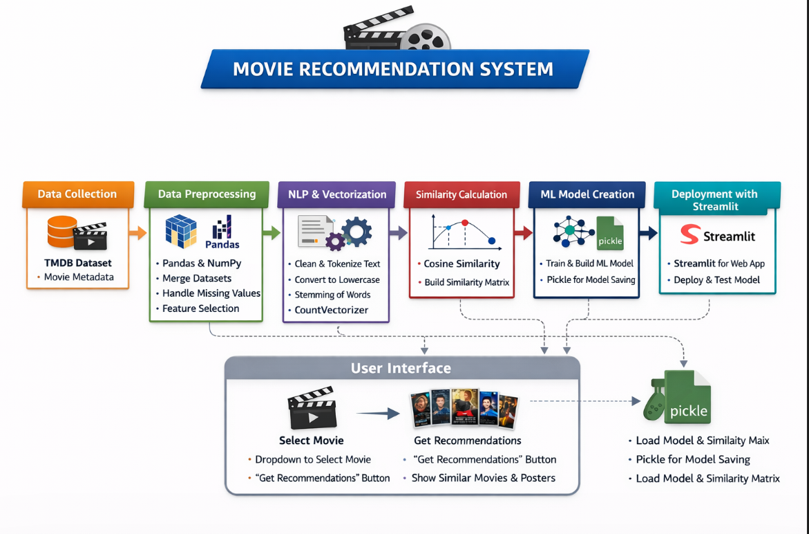
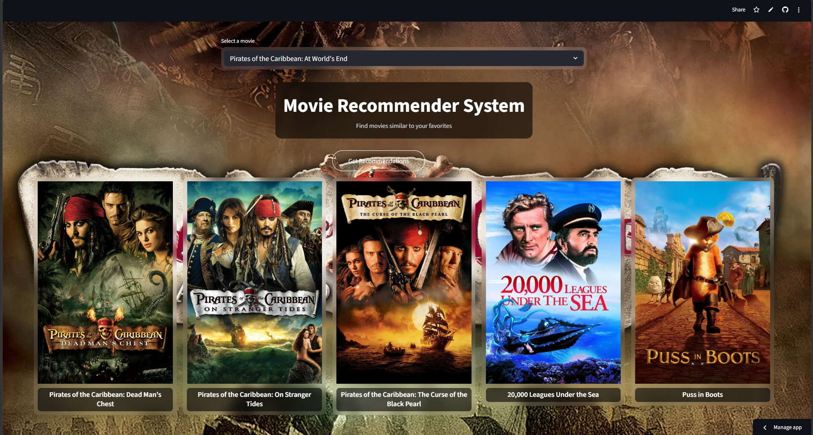

# 🎬 Movie Recommendation System  

A Machine Learning-based Movie Recommendation System that suggests similar movies based on user selection. This project demonstrates the complete ML pipeline — from data preprocessing to deployment using Streamlit.

---

## 🚀 Features  

- 🔍 Recommend movies similar to a selected movie  
- ⚡ Fast similarity-based recommendations using vectorization  
- 🎥 Movie posters fetched dynamically using TMDB API  
- 🌐 Interactive web app built with Streamlit  
- 📊 Clean UI with real-time progress feedback  

---

## 🧠 Project Workflow  

### 1. Data Collection  
- Dataset: TMDB 5000 Movies & Credits  
- Contains metadata like cast, crew, genres, overview, etc.

---

### 2. Data Preprocessing  
Performed using:  
- NumPy → numerical operations  
- Pandas → data manipulation and cleaning  

Steps include:  
- Merging datasets  
- Handling missing values  
- Feature selection  
- Text cleaning  

---

### 3. Feature Engineering (NLP)  

- Combined important columns into a single text feature  
- Applied Natural Language Processing (NLP) techniques:
  - Tokenization  
  - Lowercasing  
  - Removing spaces  
  - Stemming (to reduce words to root form)

---

### 4. Text Vectorization  

- Used CountVectorizer (from sklearn)  
- Converted textual data into numerical vectors  
- Created a similarity matrix using cosine similarity  

This enables the system to find movies with similar content.

---

### 5. Machine Learning Model  

- Built a similarity-based recommendation model  
- Stored processed data using pickle  

---

### 6. Deployment using Streamlit  

The application is deployed using Streamlit, which allows turning Python scripts into interactive web apps.

Key Features in App:
- Movie selection dropdown  
- "Get Recommendations" button  
- Dynamic progress bar  
- Poster fetching via TMDB API  
- Clean UI with custom CSS  

---

## 🛠️ Tech Stack  

- Python  
- NumPy  
- Pandas  
- Scikit-learn  
- NLTK (for stemming)  
- Streamlit  
- Pickle  
- TMDB API  

## 🏁 Conclusion

This project demonstrates how Machine Learning techniques like content-based filtering and cosine similarity can be used to build an effective movie recommendation system. It highlights key concepts such as data preprocessing, feature engineering, and model optimization, serving as a strong foundation for developing more advanced recommender systems.

